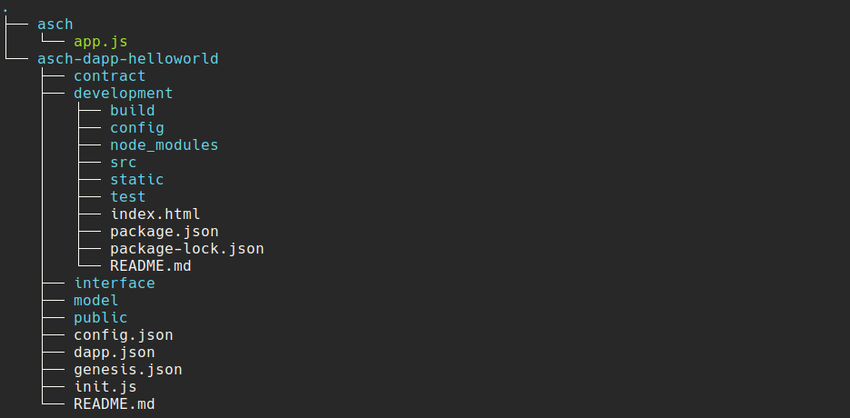

# asch-redeploy
A hassle-free local asch environment. Watch for changes on your Dapp and re-deploy it automatically.


# Installation

```
# install asch-redeploy
npm install --global asch-redeploy@1.0.0
```

# Setup Development Environment

```
# setup folder structure
mkdir ide

# change directory
cd ide

# clone asch node
git clone https://github.com/aschplatform/asch.git && \
  cd asch && \
  npm install && \
  cd ..

# clone dapp-starter-kit
git clone https://github.com/AschPlatform/asch-dapp-helloworld.git && \
  cd 'asch-dapp-helloworld/development' && \
  npm install && \
  cd ../..
```

You should have the following folder structure




-------------------------


## Start Dapp Backend

Start the Dapp Backend and listen for file changes.

The Dapp-Backend is in the `asch-dapp-helloworld` folder. If you change something in one of the files, a new Dapp will be deployed to the localnet.

```bash

# change directory
cd asch-dapp-helloworld

# execute (watch for changes)
asch-redeploy

###################################################
### you can set different ENVIRONMENT variables ###
###################################################

# required: absolute path to the asch directory (where app.js file lives)
ASCH_NODE_DIR='/pathToAschDir' asch-redeploy

# required: absolute Path to dappConfig.json file
#  write dappId to file (for frontend-development)
OUTPUT_FILE='/home/user/ide/asch-dapp-helloworld/development/src/dappConfig.json' asch-redeploy

# optionL start asch-node on different port
ASCH_NODE_PORT='5000' asch-redeploy


# or use all together
ASCH_NODE_DIR='/pathToAschDir' \
ASCH_NODE_PORT='5000' \
OUTPUT_FILE='/home/user/ide/asch-dapp-helloworld/development/src/dappConfig.json' \
asch-redeploy
```


## Start Dapp Frontend

Start the frontend Vue.js App. The Dapp-Frontened is in the `asch-dapp-helloworld/development` folder.

Run `npm run dev` to start the Vue.js dev server. If a new Dapp is registered on the localnet, the new `DappId` will be written to `asch-dapp-helloworld/development/src/dappConfig.json` file. This triggers a automatic rebuild of the Dapp Frontend.


