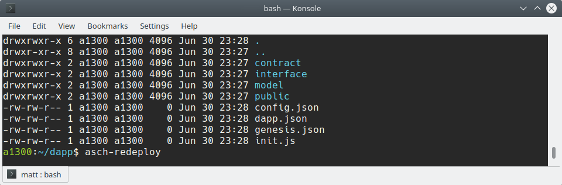

[](https://travis-ci.org/AschPlatform/asch-redeploy)
[](http://aschplatform.mit-license.org)
[](https://github.com/AschPlatform/asch-redeploy)
- - -


# `asch-redeploy`
A hassle-free local asch environment. Watch for changes on your Dapp and re-deploy it automatically.

# Warning
This program is currently only ready for local Dapp development. Do __not__ use it in production.

# Installation

Install the newest asch-redeploy version:  
```
npm install --global asch-redeploy
```

# Usage

`asch-redeploy` automates many manual steps during local Dapp development. If you are developing your Dapp then `asch-redeploy` listes for file changes and registeres your Dapp on your local Asch network every time a file changes.

You don't need to start the asch blockchain `asch-redeploy` starts it for you.  

Start `asch-redeploy` in your Dapp directory:  
```bash
$ asch-redeploy
```



# asch-redeploy CLI

```bash
Options:
-a, --asch <path>        Path to Asch directory, default "../asch"
-h, --host <host>        Host name, default "localhost"
-p, --port <port>        Port nuber, default "4096"
    --magic <magic>      Http-Header "Magic", default "594fe0f3"
-g, --genesis <secret>   The secret of the respective genesis 
                         account
-m, --master <secret>    The master secret with which the Dapp
                         should be registered with
-m2, --master2 <secret>  The 2nd master secret with which the
                         Dapp should be registered with
-d, --delegates <del>    An array of delegate secrets with which
                         the Dapp should be registered with. Delegates
                         must be provided comma separated "secret_1,secret_2,secret3"
-o, --output <file>      File in which the <dapp Id> of the
                         registered Dapp will be saved
-h, --help               output usage information
```

All options have useful defaults. Normally you don't have to change anything.  

<br />

## Example Dapps
* [cctime](https://github.com/AschPlatform/cctime)
* [asch-dapp-helloworld](https://github.com/AschPlatform/asch-dapp-helloworld)
