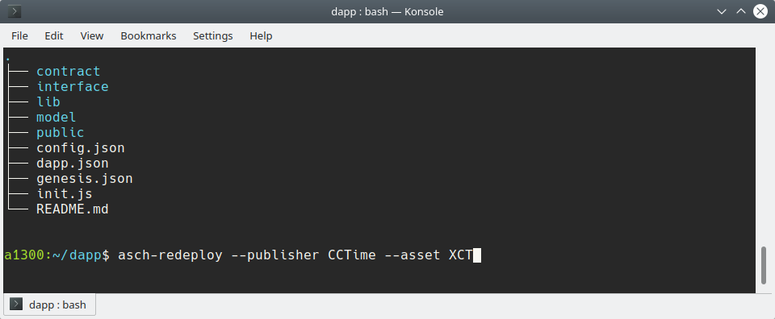

[](https://travis-ci.org/AschPlatform/asch-redeploy)
[](http://aschplatform.mit-license.org)
[](https://github.com/AschPlatform/asch-redeploy)

[](https://github.com/AschPlatform/asch-redeploy)

- - -


# `asch-redeploy`
A hassle-free local asch environment. Watch for changes on your Dapp and re-deploy it automatically.

# Warning
This program is currently only ready for local Dapp development. Do __not__ use it in production.

# Installation

Install the newest asch-redeploy version:  
```
npm install --global asch-redeploy
```

# Usage

`asch-redeploy` automates many manual steps during local Dapp development. If you are developing your Dapp then `asch-redeploy` listens for file changes and registers your Dapp on your local Asch blockchain every time a file changes.

You don't need to start the asch blockchain `asch-redeploy` starts it for you.  

Start `asch-redeploy` in your Dapp directory:  
```bash
$ asch-redeploy
```


<br/>
<br/>
<br/>


# asch-redeploy Options

### --publisher name
`--publisher` Registers the `master` account (see below) as a publisher. With the publisher it is possible to register multiple assets. One account can only be registered as one publisher.  

### --asset name
`--asset` Registers an asset

> Example:  
> Publisher: `CCTime`, Asset: `XCT`  
> Creates asset `CCTime.XCT`, this asset can be used in Dapps.




### --asch directory
`-a --asch` Points to the `asch` directory where the local Asch blockchain lives. Default `../asch`


### --host name
`-h --host` Set the host name on which the local Asch node should be started. Default `http://localhost`

### --port number
`-p --port` Set the port on which the local Asch node should be started. Default `4096`

### --magic string
`   --magic` Set the HTTP-Header "Magic" in order to install Dapps on the local Asch node, default `594fe0f3`

### --genesis secret
`-g --genesis` Set the genesis secret of the local Asch node. The genesis account is the account where all the money of the local blockchain is initally located. This account has hundred million XAS (XAS is our standard currency). This Genesis account is used to provide our master account with enough money.  

Default Genesis account:  
```json
{
  "secret": "stone elephant caught wrong spend traffic success fetch inside blush virtual element",
  "publicKey": "116025d5664ce153b02c69349798ab66144edd2a395e822b13587780ac9c9c09",
  "address": "ABuH9VHV3cFi9UKzcHXGMPGnSC4QqT2cZ5"
}
```

### --master secret
`-m, --master` Set the secret for our master account. This account manages the preparation and registration of new Dapps.

Default Master Secret:  
```json
{
  "secret": "sentence weasel match weather apple onion release keen lens deal fruit matrix",
  "publicKey": "a7cfd49d25ce247568d39b17fca221d9b2ff8402a9f6eb6346d2291a5c81374c",
  "address": "AHMCKebuL2nRYDgszf9J2KjVZzAw95WUyB",
}
```

If you want to use another account, you can:  


### --master2 secret
`-2 --master2` Set the 2nd secret of our master account. This is only necessary if this account has the 2nd secret enabled.

### Custom delegates
Specify your custom delegates in the `config.json` file. These delegates will be used to register your DApp and will be used for block generation (forging) on the newly registered DApp.


Example `config.json`:  
```json
{
  "peers": [{"ip":"127.0.0.1","port":4096}],
  "secrets": [
    "flame bottom dragon rely endorse garage supply urge turtle team demand put",
    "thrive veteran child enforce puzzle buzz valley crew genuine basket start top",
    "black tool gift useless bring nothing huge vendor asset mix chimney weird",
    "ribbon crumble loud chief turn maid neglect move day churn share fabric",
    "scan prevent agent close human pair aerobic sad forest wave toe dust"
  ]
}
```

### --output file
`-o, --output` You can specify a file to which the new dapp-name will be written to every time a new Dapp was registered at the local Asch blockchain. This file can be very useful combined with a build server for frontend Dapp development. Every time the new Dapp will be registered the frontend rebuilds and automatically connects to the newest DappId.


Usage:  
```bash
asch-redeploy --output ./dappId.json
```

Produces the following `dappName.json` file in the current directory (`./`):  
```json
{
  "host": "http://localhost",
  "port": "4096",
  "dappId": "4160d918edfbcae7fa508ed9ae2fce836537b8a2e6355a8ae69f8924867c16cb",
  "dappName": "salt-sugar-dapp"
}
```


### --help
`--help` Display help information.  


<br/>
<br/>
<br/>

# How does asch-redeploy work?
The `asch-redeploy` package automates numerous manual steps to register and install your Dapp on your local Asch blockchain.  

1. Prepare master account  
  1.1 Transfer 20000 XAS from genesis account to master account - only if not previously transferred
2. (optional) Prepare Publisher, Asset, Tokens  
  2.1 Register publisher (e.g publisher CCTime with `--publisher CCTime`) on local Asch blockchain  
  2.2 Register asset (e.g asset XCT with `--asset XCT`) on local Asch blockchain  
  2.3 Create 20000 `CCTime.XCT` Tokens - only if not previously created
3. Register Dapp on local Asch blockchain  
  3.1 Create random name for Dapp (e.g. `sugar-salt-dapp`) - two Dapps with same name are not allowed  
  3.2 Create Dapp registration transaction - the `dappName` with which the Dapp was registered with can be used to uniquely identify our new Dapp  
4. Install Dapp on local Asch blockchain  
  4.1 Copy smart contract files (your working directory) to `asch/chains/<our-dapp-name>`  
  4.2 Restart local Asch blockchain to finish installation  
5. Watch for file changes and start with __1.__ if a file changes  


If you want you can also follow the manual steps as described [here](https://github.com/AschPlatform/asch-docs/blob/master/dapp/hello_world/en.md)


# Example Dapps
* [cctime](https://github.com/AschPlatform/cctime)
* [asch-dapp-helloworld](https://github.com/AschPlatform/asch-dapp-helloworld)
