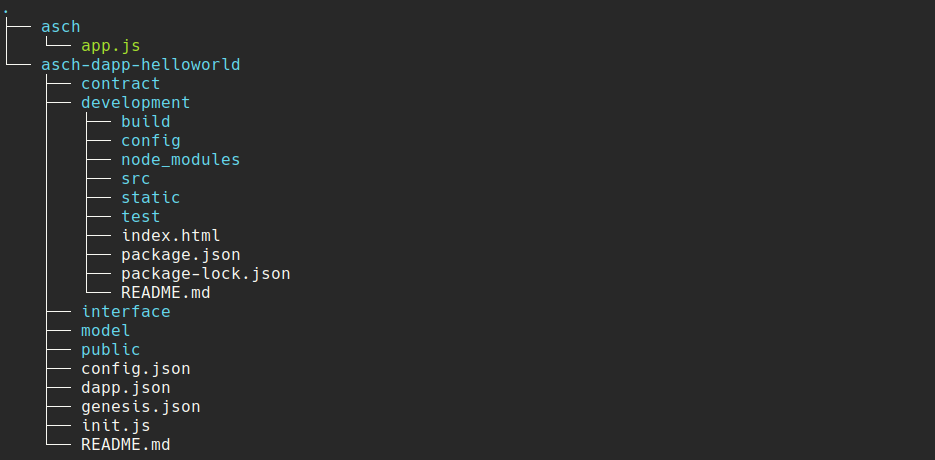

# How to use `asch-redeploy`


# Setup

```
# install asch-redeploy
npm install --global asch-redeploy@1.0.0

# setup folder structure
mkdir ide
cd ide

# clone asch node
git clone https://github.com/aschplatform/asch.git asch && cd asch && npm install && cd ..

# clone dapp-starter-kit
git clone https://github.com/AschPlatform/asch-dapp-helloworld.git && \
  cd 'asch-dapp-helloworld/development' && \
  npm install && \
  cd ../..
```

You should have the following folder structure




## Work on Dapp Backend

The Dapp-Backend is in the `asch-dapp-helloworld` folder. If you change something in one of the files, a new Dapp will be deployed to the localnet.

## Work on Dapp Frontend

The Dapp-Frontened is in the `asch-dapp-helloworld/development` folder.

Run `npm run dev` to start the Vue.js dev server. If a new Dapp is registered on the localnet, the new `DappId` will be written to `asch-dapp-helloworld/development/src/dappConfig.json` file. This triggers a automatic rebuild of the Dapp Frontend.